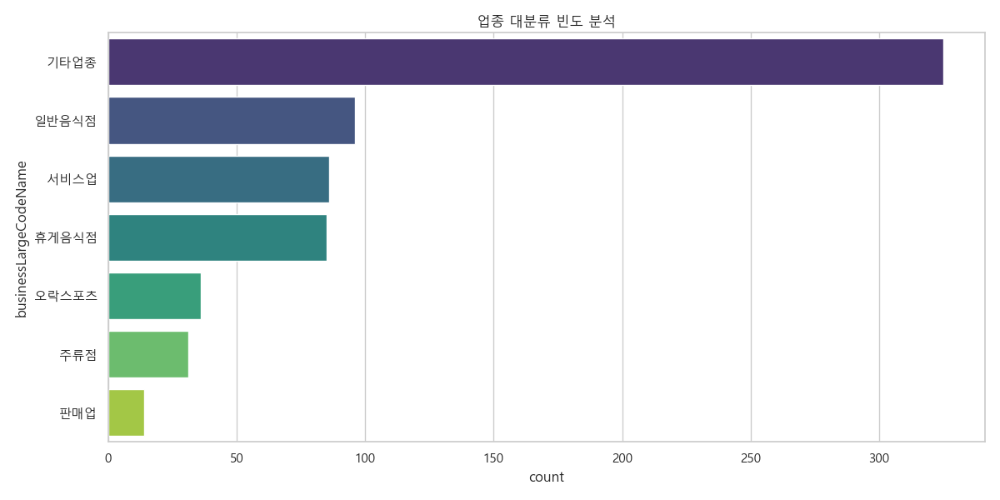
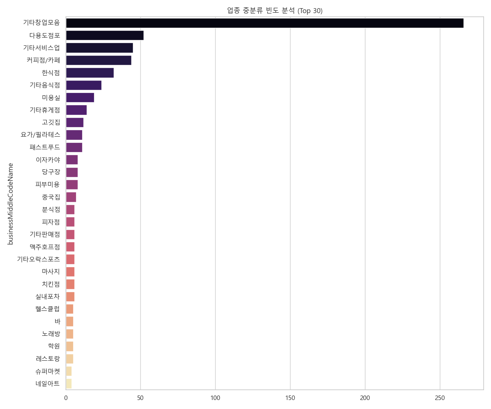
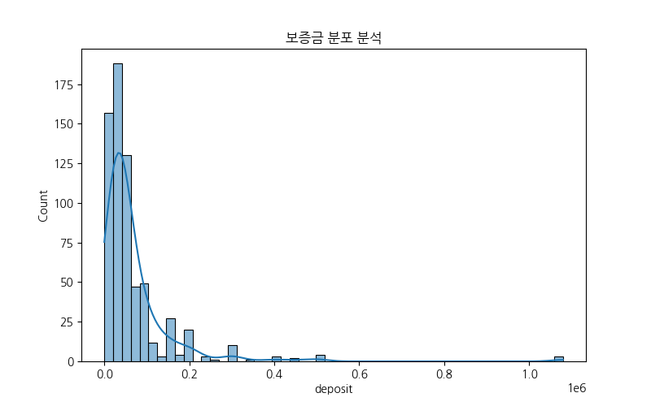
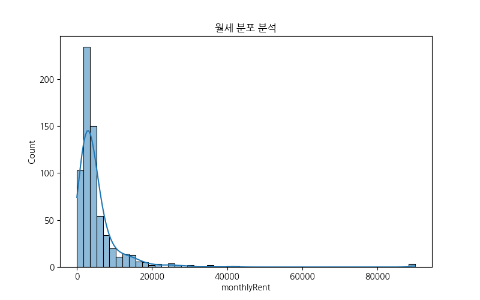
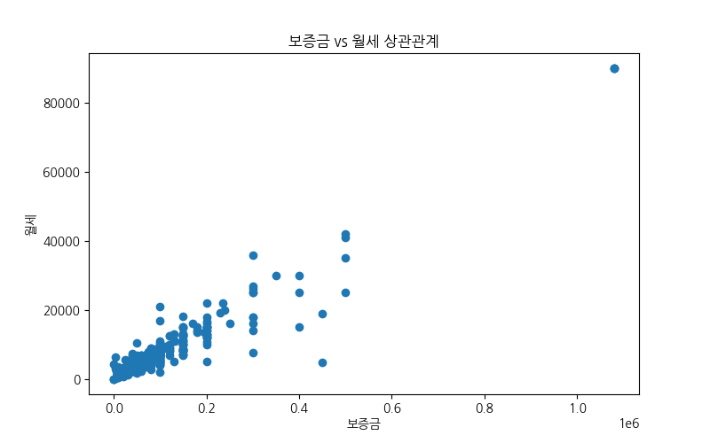
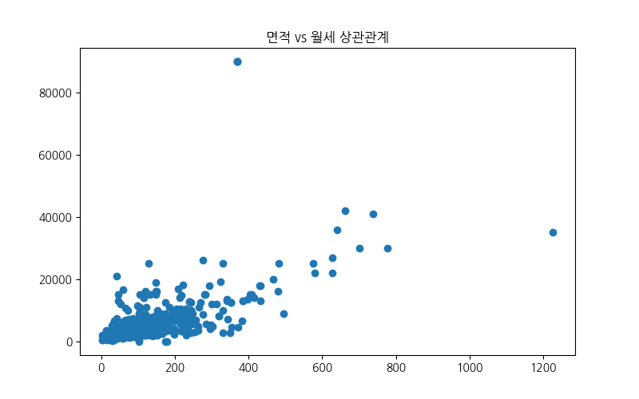

# NEMO ANALYSIS
### 강남권 상업용 부동산 데이터 분석 포트폴리오
#### DATA-DRIVEN BUSINESS STRATEGY

  

**DATA ANALYST**
MARKET INTELLIGENCE TEAM

<!-- 
발표자 노트 (약 2분):
안녕하세요. 데이터 분석가로서 강남권 상업용 부동산 시장의 실제 매물 데이터를 활용한 포트폴리오 발표를 시작하겠습니다. 본 프로젝트의 핵심은 '데이터가 비즈니스에 어떻게 실질적인 가치를 더할 수 있는가'를 증명하는 데 있습니다. 스위스 인터내셔널 스타일의 간결하고 명확한 구성을 통해 분석의 논리적 흐름을 전해드리겠습니다.
-->

---

## 0. 분석 동기
### ANALYSIS BACKGROUND

- **정보 비대칭성 해소**
  광고 매물과 실거래 데이터 간의 가격 격차 심층 분석
- **투자 리스크 정량화**
  임대료·권리금·공실률 분포 및 변동성 정밀 측정
- **상권별 수익성 평가**
  유동인구, 업종 밀집도, 임대료 간 상관관계 규명
- **적정 임대료 기준 제시**
  유사 입지 및 업종 간 가격 분포와 이상치 비교 분석

<!-- 
발표자 노트 (약 2분):
본 분석은 상업용 부동산 시장의 고질적인 문제를 정량적인 데이터로 해결하고자 시작되었습니다. 정보 비대칭 해소부터 투자 리스크 정량화까지, 데이터 기반의 합리적인 가이드라인 수립을 목표로 합니다.
-->

---

## 1. 데이터 개요
### DATASET SPECIFICATION

  
TOTAL SAMPLES

  
673

  
CLEANED RECORDS

  
VARIABLES

  
40+

  
FEATURES ANALYZED

 

- **수집 대상**: Nemo 플랫폼 강남권 상가/사무실 매물
- **데이터 정제**: 중복 제거 및 이상치 식별 (무결성 확보)
- **주요 변수**: 보증금, 월세, 권리금, 전용면적, 층수 등

<!-- 
발표자 노트 (약 2분):
데이터는 Nemo 플랫폼에서 수집된 673건의 고품질 매물 정보를 사용했습니다. 40개 이상의 변수를 통해 다각도 분석을 진행했으며, 엄격한 정제 과정을 거쳐 신뢰도를 높였습니다.
-->

---

## 2. 수치형 데이터 분석
### PRICE MECHANISM

  
AVG DEPOSIT

  
6,895만

  
MEDIAN: 4,000만

  
AVG RENT

  
534만

  
MEDIAN: 340만

 

- **양극화 현상**: 중앙값 대비 높은 평균값 (초고가 프리미엄 매물 영향)
- **주류 시장**: 보증금 4,000만 / 월세 340만 내외의 중소형 매물
- **면적 특성**: 평균 127.5㎡ (약 38평) 규모가 주류 형성

<!-- 
발표자 노트 (약 2분):
가격 데이터를 보면 강남 시장의 양극화가 뚜렷합니다. 평균값은 소수의 럭셔리 매물로 인해 높게 형성되어 있으나, 실제 주류 시장은 보증금 4,000, 월세 340 수준에서 형성되어 있음을 중앙값을 통해 확인할 수 있습니다.
-->

---

## 3. 범주형 데이터 분석
### MARKET SEGMENTATION

- **업종 구성**: **OFFICE (48%)** vs **F&B (40%)** 공존 구조
- **세부 업종**: 카페, 다용도점포, 한식점 등 실생활 밀착형 중심
- **입지 특징**: 역삼, 강남, 신논현 등 초역세권 집중 (90%+)
- **핵심 키워드**: '역세권', '인테리어 완비'가 실제 계약의 핵심 동인

<!-- 
발표자 노트 (약 2분):
강남 상권은 거대 업무 지구를 배후로 한 소비 시장입니다. 사무실 매물이 48%, F&B가 40%를 차지하며 상호 보완적인 생태계를 구축하고 있습니다. 최근에는 초기 투자비를 줄일 수 있는 '인테리어 완비' 매물에 대한 선호도가 매우 높습니다.
-->

---

## 4. 시각화 분석 (1)
### BUSINESS CATEGORY DISTRIBUTION

  
업종 대분류 빈도

  

  
업종 중분류 빈도 (TOP 30)

  

<!-- 
발표자 노트 (약 2분):
시각화 자료를 통해 오피스 수요와 직장인 대상 소비 상권의 복합적 구조를 확인할 수 있습니다. 다용도 점포의 높은 비중은 임대 시장의 유연성을 시사합니다.
-->

---

## 4. 시각화 분석 (2)
### PRICE DISTRIBUTION ANALYSIS

  
보증금 분포 (DEPOSIT)

  

  
월세 분포 (RENT)

  

<!-- 
발표자 노트 (약 2분):
전형적인 우측 편향 분포를 보여줍니다. 대다수 매물이 특정 가격대(Sweet Spot)에 밀집되어 있으며, 이를 벗어난 매물은 특수 목적의 하이엔드 시장으로 분류됩니다.
-->

---

## 4. 시각화 분석 (3)
### CORRELATION MATRIX

  
보증금 vs 월세 상관관계

  

  
전용면적 vs 월세 상관관계

  

<!-- 
발표자 노트 (약 2분):
면적과 월세는 매우 강한 선형 관계를 보입니다. 하지만 동일 면적 내에서도 입지나 시설 상태에 따라 발생하는 가격 오차 범위가 '가성비 매물' 발굴의 핵심 포인트가 됩니다.
-->

---

## 5. 비지니스 전략 제언
### STRATEGIC RECOMMENDATIONS

1. **임차인 전략**
   - 중앙값(4000/340) 기반의 현실적 예산 수립 및 허위 매물 필터링
   - '무권리/인테리어 승계' 매물 선점으로 초기 투자 리스크 최소화
2. **임대인 전략**
   - 공실 단축을 위한 유연한 임대 조건(Rent-free 등) 및 시설 유지 제안
3. **플랫폼 전략**
   - '시설 상태' 데이터 기반의 정교한 필터링 및 적정가 가이드 제공

<!-- 
발표자 노트 (약 2분):
데이터 분석을 통한 결론입니다. 임차인은 중앙값을 기준점으로 삼아 합리적 계약을 이끌어내야 하며, 임대인은 시설 유지를 통해 공실 리스크를 줄이는 전략이 필요합니다.
-->

---

## 6. 결론 및 향후 과제
### FINAL SUMMARY

- **결론**: 강남 상권은 데이터 기반 '가성비 틈새'가 명확히 존재하는 양극화 시장
- **향후 과제**: 
  - 시계열 분석을 통한 임대료 변동 예측 모델 구축
  - 주변 유동인구 및 매출 데이터 결합을 통한 수익성 지수 개발

<!-- 
발표자 노트 (약 2분):
강남은 여전히 기회의 땅입니다. 저희는 앞으로 시계열 예측과 매출 데이터를 결합하여 더욱 정교한 부동산 가치 산정 모델을 만들어갈 계획입니다. 감사합니다.
-->

---

# Q&A
### THANK YOU.

<!-- 
발표자 노트:
발표를 마쳤습니다. 질문 있으시면 편하게 말씀해 주시기 바랍니다.
-->
