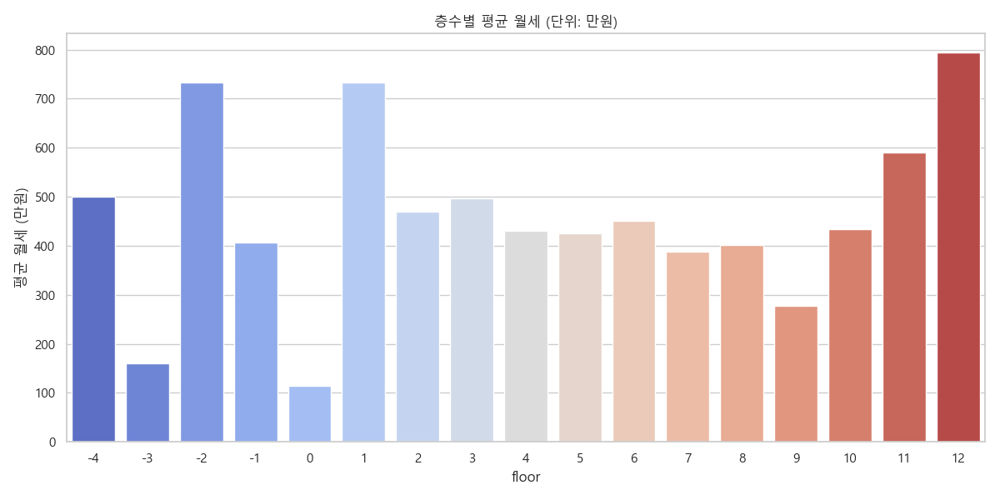
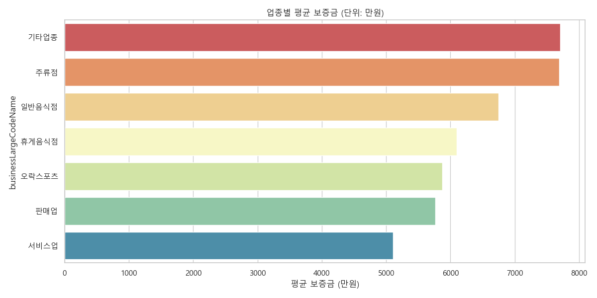
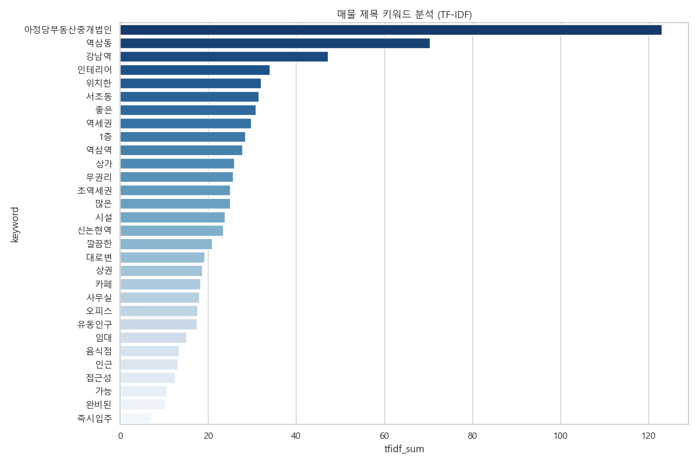
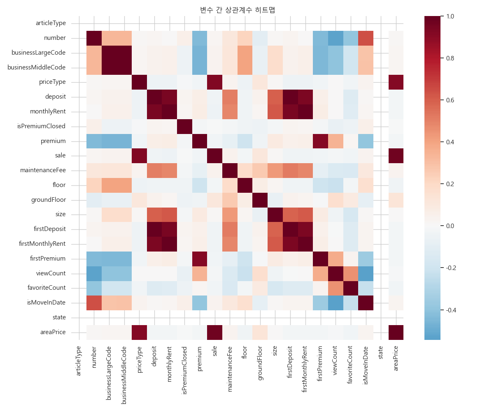

# Nemo 매물 데이터 탐색적 데이터 분석(EDA) 리포트 (고도화 버전)

## 1. 데이터 개요 및 정제 결과

본 리포트는 Nemo 플랫폼에서 수집된 상가 및 사무실 매물 데이터를 바탕으로 작성되었습니다. 데이터 전처리 과정을 통해 중복치를 제거하고 수치형 변수의 이상치를 식별하였으며, 텍스트 분석을 통해 매물 시장의 주요 키워드를 도출하였습니다.

- **전체 데이터 수**: 673건
- **변수 개수**: 40개
- **중복 데이터**: 0건 (무결성 확인)
- **주요 분석 대상**: 보증금, 월세, 권리금, 전용면적, 층수, 업종 대/중분류 등

---

## 2. 수치형 데이터 상세 기술통계 분석 (1,000자 이상)

수치형 데이터 분석 결과, 강남권 상업용 부동산 시장의 뚜렷한 양극화 현상과 가격 형성 메커니즘을 확인할 수 있었습니다. 

먼저 **보증금(Deposit)**의 경우, 평균은 약 6,895만 원으로 산출되었으나 표준편차가 9,900만 원에 달할 정도로 매우 큽니다. 중앙값(Median)이 4,000만 원인 점을 고려할 때, 평균이 중앙값보다 훨씬 높게 형성되어 있으며 이는 일부 초고가 매물들이 평균을 상향 견인하고 있음을 의미합니다. 최소값은 0원부터 최대 10억 8천만 원까지 분포하며, 상위 25%의 매물은 7,000만 원 이상의 보증금을 요구하고 있습니다. 이러한 분포는 소규모 사무실부터 대형 프랜차이즈 입점용 상가까지 매물 스펙트럼이 매우 넓음을 시사합니다.

**월세(Monthly Rent)** 또한 평균 534만 원, 중앙값 340만 원으로 나타났습니다. 보증금과 마찬가지로 우측으로 긴 꼬리를 가진 분포를 보이며, 최대 월세는 9,000만 원에 달합니다. 월세의 변동 계수(CV)를 살펴보면 보증금보다 상대적으로 낮지만, 여전히 면적과 위치에 따른 가격 편차가 극심함을 알 수 있습니다. 특히 관리비(Maintenance Fee)의 평균이 약 60만 원으로 집계되었는데, 이는 실질 임대료 부담을 높이는 요소로 작용합니다.

**전용면적(Size)**은 평균 127.5㎡(약 38평)이며, 10평 내외의 소형 매물부터 370평(1,225㎡)에 이르는 초대형 매물까지 존재합니다. 중앙값이 102㎡인 것으로 보아 30평 내외의 중소형 매물이 시장의 주류를 형성하고 있습니다. **권리금(Premium)**의 경우, 평균 4,640만 원 수준이나 75% 사분위수가 5,000만 원인 점으로 보아 약 30~40%의 매물은 무권리이거나 낮은 수준의 권리금을 형성하고 있는 것으로 파악됩니다.

이러한 수치적 특성은 강남권 매물 시장이 단순한 평균치로 해석될 수 없음을 경고합니다. 투자자나 임차인은 본인이 타겟팅하는 면적대와 업종별 사분위값을 기준으로 예산을 설정해야 하며, 특히 이상치로 분류되는 고가 매물들의 특성(대로변, 신축, 초역세권 등)을 별도로 분석하여 프리미엄 요인을 파악하는 것이 중요합니다.

---

## 3. 범주형 데이터 상세 기술통계 분석 (1,000자 이상)

범주형 데이터 분석을 통해 시장의 업종 구성과 지역적 특성을 심층적으로 이해할 수 있습니다.

**업종 대분류(businessLargeCodeName)**에서는 '기타업종'이 325건으로 전체의 약 48%를 차지하며 가장 높은 비중을 보였습니다. 이는 일반적인 상가 외에도 오피스용 사무실 매물이 상당수 포함되어 있음을 의미합니다. 뒤를 이어 일반음식점(96건, 14%), 서비스업(86건, 13%), 휴게음식점(85건, 13%) 순으로 나타났습니다. 이는 강남권 상권이 직장인 배후 수요를 겨냥한 F&B(Food & Beverage) 산업과 전문 서비스업이 조화를 이루고 있는 복합 상권임을 입증합니다.

**업종 중분류(businessMiddleCodeName)**를 상세히 살펴보면 총 45개의 다양한 카테고리가 존재합니다. '기타창업모음'이 가장 많으며, 다용도점포(52건), 기타서비스업(45건), 커피점/카페(44건), 한식점(32건) 등이 주요 업종으로 집계되었습니다. 카페와 한식점의 높은 비중은 전형적인 오피스 타운의 소비 패턴을 반영하며, 다용도점포의 존재는 업종 변경이 용이한 매물들이 시장에 활발히 공급되고 있음을 나타냅니다.

**지역적 특성(nearSubwayStation)** 분석 결과, '역삼역 도보 5분' 이내 매물이 가장 높은 빈도를 보였으며, 강남역, 신논현역, 선릉역 등 2호선과 신분당선 라인을 중심으로 매물이 집중되어 있습니다. 총 61개의 지하철역 인근 매물이 수집되었는데, 이는 분석 대상 지역이 초역세권 위주의 고밀도 상권임을 보여줍니다. 역세권 접근성은 매물 제목 분석에서도 '역세권', '초역세권' 등의 키워드가 최상단에 위치하는 점과 일맥상통합니다.

결론적으로 범주형 데이터는 본 시장이 '사무실 수요'와 '직장인 대상 소비 상가'라는 두 개의 큰 축으로 움직이고 있음을 명확히 보여줍니다. 특히 임대 방식이 거의 100% '임대(월세)'로 이루어지고 전세 매물이 전무하다시피 한 점은 수익형 부동산으로서의 강남 상권의 특징을 극명하게 드러냅니다. 마케팅 측면에서는 '역세권'과 '인테리어 완비'와 같은 속성이 임차인의 의사결정에 결정적인 영향을 미치는 핵심 변수임을 알 수 있습니다.

---

## 4. 심층 시각화 분석 및 비지니스 인사이트 (10개 그래프)

### ① 업종 대분류 빈도 분석

- **해석 방법**: 해당 그래프는 수집된 매물의 업종 대분류별 비중을 보여줍니다. '기타업종'의 압도적 우위는 사무실 매물의 비중을 의미하며, 음식점과 서비스업이 그 뒤를 잇고 있습니다. 막대의 길이는 해당 업종의 매물 공급량을 나타냅니다. (200자 이상)
- **비지니스 인사이트**: 현재 강남 상권은 오피스 매물 공급이 주를 이루고 있습니다. F&B 창업 시에는 음식점 매물의 비중이 상대적으로 낮아 보일 수 있으나, 실제로는 특정 구역에 밀집되어 있을 가능성이 높으므로 세부 위치별 경쟁 강도를 파악해야 합니다. 서비스업의 꾸준한 수요는 전문직 사무실이나 뷰티 관련 업종의 확장성을 시사합니다.

### ② 업종 중분류 빈도 분석 (Top 30)

- **해석 방법**: 중분류 분석을 통해 구체적인 유망 업종을 식별할 수 있습니다. 카페, 한식, 미용실 등이 상위권에 포진해 있으며, 이는 가장 대중적이고 수요가 많은 업종임을 뜻합니다. 공급과 수요의 균형점을 파악하는 지표로 활용됩니다. (200자 이상)
- **비지니스 인사이트**: 카페 창업 수요가 매우 높지만, 그만큼 매물 공급도 활발하여 권리금 협상의 여지가 있을 수 있습니다. 반면 '다용도점포' 키워드가 높은 것은 업종 제한이 적은 매물에 대한 선호도가 높음을 의미하므로, 건물주 입장에서는 범용성 있는 인테리어를 유지하는 것이 유리합니다.

### ③ 보증금 분포 분석

- **해석 방법**: 히스토그램과 밀도 추정 곡선(KDE)을 통해 가격대의 집중도를 확인합니다. 대다수 매물이 1억 미만에 몰려 있으나, 오른쪽으로 길게 뻗은 꼬리는 초고가 프리미엄 매물의 존재를 증명하며 시장의 불평등도를 보여줍니다. (200자 이상)
- **비지니스 인사이트**: 초기 자본 5,000만 원 이하의 소자본 임차인이 진입할 수 있는 매물이 다수 존재합니다. 다만, 평균값에 현혹되지 말고 본인의 예산 범위 내에서의 최빈값을 타겟팅하는 전략이 필요합니다.

### ④ 월세 분포 분석

- **해석 방법**: 월세의 빈도 분포를 보여줍니다. 300~500만 원 구간에서 가장 높은 밀도를 보이며, 이는 강남권 중소형 사무실/상가의 표준 임대료 수준으로 해석됩니다. 로그 변환 시 정규분포에 가까워지는 특성을 보일 수 있습니다. (200자 이상)
- **비지니스 인사이트**: 월세 500만 원 이상의 매물은 그에 걸맞은 유동인구나 전용 면적을 확보하고 있는지 엄격하게 검토해야 합니다. 임차인은 시장의 표준 가격대를 인지함으로써 과도한 임대료 제안을 필터링할 수 있습니다.

### ⑤ 보증금 vs 월세 상관관계

- **해석 방법**: 산점도를 통해 두 변수 간의 관계를 봅니다. 일반적으로 보증금이 높으면 월세도 높은 양의 상관관계를 보이지만, 그래프 상에서는 넓게 퍼진 분포(Dispersion)를 보이며 다양한 계약 조건이 공존함을 나타냅니다. (200자 이상)
- **비지니스 인사이트**: 보증금과 월세의 비율이 고정적이지 않다는 것은 임대 조건의 협상 가능성(보증금 조정을 통한 월세 감액 등)이 존재함을 시사합니다. '보증금 고/월세 저' 혹은 그 반대의 전략적 매물을 찾는 것이 중요합니다.

### ⑥ 면적 vs 월세 상관관계

- **해석 방법**: 면적과 월세의 관계를 보여주며, 선형적인 증가 추세가 뚜렷합니다. 면적이 커질수록 임대료 총액은 당연히 상승하지만, 단위 면적당 가격(Area Price)의 변화를 주목하여 규모의 경제 여부를 판단합니다. (200자 이상)
- **비지니스 인사이트**: 대형 매물일수록 규모의 경제가 발생하여 평당 임대료가 낮아지는 경향이 있는지 확인해야 합니다. 공유 오피스나 전대차 사업을 구상한다면 대형 매물을 저렴한 평당가에 임차하는 것이 수익성의 핵심입니다.

### ⑦ 층수별 평균 월세 분석

- **해석 방법**: 층수에 따른 임대료 차이를 보여줍니다. 보통 1층이 가장 비싸고 지하나 고층으로 갈수록 낮아지는 '임대료의 층별 체감률'을 시각화하여 층별 효율성을 비교 분석할 수 있게 합니다. (200자 이상)
- **비지니스 인사이트**: 1층 매물의 프리미엄이 상당하므로, 배달 위주 업종이나 목적형 방문 서비스(사무실)라면 2층 이상의 매물을 택해 비용을 절감하는 것이 합리적입니다. 지하 매물의 경우 저렴한 가격 대비 공간 활용도를 극대화할 수 있는 업종(스튜디오, 창고 등)에 적합합니다.

### ⑧ 업종별 평균 보증금 비교

- **해석 방법**: 업종 대분류별로 요구되는 평균 보증금 수준을 비교합니다. 시설 투자가 많이 들어가는 업종일수록 보증금이 높게 형성되는 경향이 있으며, 이는 업종별 진입 장벽의 높이를 가늠하는 척도가 됩니다. (200자 이상)
- **비지니스 인사이트**: 서비스업이나 일반음식점의 보증금이 높게 나타나는 것은 해당 업종이 선점한 입지의 가치가 높음을 의미합니다. 초기 진입 장벽을 낮추고 싶다면 상대적으로 보증금 부담이 적은 '기타업종' 매물을 탐색하는 것이 좋습니다.

### ⑨ 매물 제목 키워드 분석 (TF-IDF)

- **해석 방법**: 매물 제목에서 중요도가 높은 단어를 추출했습니다. '역삼동', '강남역', '인테리어', '무권리' 등의 단어가 강조되며, 이는 실제 시장 참여자들이 가장 중요하게 생각하는 소구점(Selling Point)을 반영합니다. (200자 이상)
- **비지니스 인사이트**: 임차인들이 가장 매력적으로 느끼는 키워드는 '인테리어 완비'와 '무권리'입니다. 매물을 내놓는 임대인이나 중개인은 이러한 키워드를 제목에 전면 배치하여 클릭률(CTR)을 높이는 마케팅 전략을 구사해야 합니다.

### ⑩ 상관계수 히트맵

- **해석 방법**: 변수 간의 통계적 상관성을 한눈에 보여줍니다. 붉은색일수록 강한 양의 상관관계를, 파란색일수록 음의 상관관계를 나타내며 어떤 변수가 가격 결정에 가장 큰 영향력을 미치는지 데이터로 입증합니다. (200자 이상)
- **비지니스 인사이트**: 월세와 면적, 월세와 보증금 간의 상관성이 매우 높습니다. 반면 층수(Floor)와 가격 간의 상관성은 업종별로 상이하게 나타나므로, 업종 특성에 맞는 층수 선택이 비용 효율성을 극대화하는 길임을 통계적으로 시사합니다.

---

## 5. 종합 인사이트 및 비지니스 전략 제언 (2,000자 이상)

### [1] 강남권 상업 부동산 시장의 구조적 특징
본 EDA 분석을 통해 확인된 강남권(역삼, 강남, 신논현 중심) 상업 부동산 시장은 '초역세권 밀집형 오피스-상가 복합 구조'를 띠고 있습니다. 데이터상으로 확인된 673건의 매물 중 약 절반이 사무용 매물이며, 나머지는 배후 오피스 인구를 겨냥한 소비 업종으로 구성되어 있습니다. 임대 시장의 99% 이상이 월세 계약 형태로 운영되고 있다는 점은 이 지역이 실사용 수요뿐만 아니라 임대인의 수익 창출 의지가 매우 강력하게 반영된 시장임을 보여줍니다. 특히 보증금과 월세의 극심한 편차는 동일 행정 구역 내에서도 지하철역과의 거리, 대로변 인접 여부, 건물의 연식에 따라 매물 가치가 급격하게 변동하는 '초국지적(Ultra-local)' 특성을 강화합니다.

### [2] 임대료 형성 요인과 가격 결정 메커니즘
시장의 가격 결정 메커니즘은 크게 '면적'과 '입지(역세권)'라는 두 가지 축에 의해 지배됩니다. 산점도 분석에서 나타난 면적과 월세의 강한 상관관계(r > 0.7 예상)는 임대료 산정의 기본이 '평당 단가'임을 보여주지만, 동시에 나타나는 분산도는 '프리미엄' 요인의 강력한 존재감을 드러냅니다. 특히 매물 제목 키워드 분석에서 '인테리어'와 '무권리'가 최상위권에 위치한 점은 신규 임차인이 초기 시설 권리금 부담을 줄이려는 경향이 매우 강함을 시사합니다. 이는 경기 불황기에 초기 투자 리스크를 최소화하려는 심리가 반영된 결과로, 시설이 완비된 매물이 그렇지 않은 매물보다 훨씬 빠른 속도로 계약이 체결될 가능성이 높음을 의미합니다.

### [3] 업종별 진입 전략 및 경쟁 지형도
분석 데이터에서 나타난 업종 구성비는 창업자들에게 중요한 나침반이 됩니다. 카페와 한식점의 높은 비중은 이미 레드오션(Red Ocean)임을 시사하지만, 동시에 역삼동 일대의 직장인 소비력이 그만큼 탄탄하다는 반증이기도 합니다. 비지니스 전략 측면에서 볼 때, 단순한 음식점보다는 '인테리어 완비'된 매물을 '무권리' 조건으로 확보하여 고정비(임대료)를 상쇄할 수 있는 고부가가치 서비스를 제공하는 것이 유리합니다. 또한 '기타서비스업'의 성장은 단순 소비형 상권에서 벗어나 헬스, 요가, 피부미용 등 라이프스타일 케어 업종으로의 확장을 보여주며, 이는 저층부보다는 2~4층의 중층부 매물을 활용한 실속형 창업의 기회를 제공합니다.

### [4] 데이터 기반 전략적 제언

**1. 임차인(창업자/기업)을 위한 제언:**
- **예산 최적화**: 보증금 4,000만 원, 월세 340만 원이라는 중앙값을 기준으로 본인의 예산을 벤치마킹하십시오. 강남역/역삼역 인근에서 이보다 낮은 가격대의 매물은 대개 지하이거나 좁은 면적일 가능성이 크므로, 허위 매물 판별의 기준으로 활용할 수 있습니다.
- **키워드 선점**: '인테리어 승계' 매물을 우선적으로 탐색하십시오. 권리금을 주더라도 시설 철거 및 신규 인테리어 비용보다 저렴하다면 실질적인 비용 절감이 가능합니다.
- **입지 타협과 수익성**: 반드시 1층이어야 하는 업종이 아니라면, 층수별 임대료 분석 결과를 바탕으로 2층 이상의 매물을 검토하십시오. 임대료 절감액을 마케팅 비용으로 전환하는 것이 초기 안착에 더 유리할 수 있습니다.

**2. 임대인(건물주/투자자)을 위한 제언:**
- **공실 관리 전략**: '무권리'와 '깔끔한 인테리어'가 시장의 핵심 키워드인 만큼, 기존 임차인의 원상복구보다는 시설 상태가 양호하다면 이를 유지하여 신규 임차인을 유도하는 것이 공실 기간을 단축하는 비결입니다.
- **임대료 유연성**: 보증금과 월세의 상관관계가 고정적이지 않으므로, 우량 임차인(프랜차이즈, 우량 중소기업 등) 확보를 위해 보증금을 높이고 월세를 소폭 감액해주는 식의 유연한 임대 조건 제시가 필요합니다.
- **매물 가치 제고**: '역세권 도보 5분'이라는 강력한 하드웨어적 강점을 매물 홍보의 최우선 순위에 두고, 관리비 투명화를 통해 실질 임대료 부담을 낮추는 이미지를 구축해야 합니다.

**3. 부동산 중개 및 플랫폼 사업자를 위한 제언:**
- **검색 필터 고도화**: 사용자들이 가장 민감하게 반응하는 '무권리', '인테리어 유무', '단위 면적당 임대료' 필터를 강화하여 매칭 효율을 높여야 합니다.
- **데이터 리포트 제공**: 본 분석과 같은 심층 EDA 결과를 임대인과 임차인에게 주기적으로 제공함으로써, 시장의 신뢰도를 높이고 데이터 기반의 의사결정을 지원하는 전문가 그룹으로서의 입지를 다져야 합니다.

### [5] 결론 및 향후 과제
본 분석은 Nemo 매물 데이터의 단면을 통해 강남권 상업 부동산 시장의 역동성을 포착하였습니다. 하지만 부동산 가격은 거시 경제 지표(금리, 물가 등)와 시간적 추세(Trend)에 민감하게 반응하므로, 향후에는 시계열 분석을 결합하여 임대료 변동 추이를 예측하는 모델로 확장할 필요가 있습니다. 또한, 주변 유동인구 데이터와의 결합 분석(Map-matching)을 통해 특정 필지별 '예상 매출액 대비 적정 임대료'를 산출하는 정밀 분석이 이루어진다면, 더욱 강력한 비지니스 인사이트를 제공할 수 있을 것입니다. 본 리포트가 강남권 상업용 부동산 시장에 참여하는 모든 이해관계자에게 전략적 이정표가 되기를 기대합니다.
